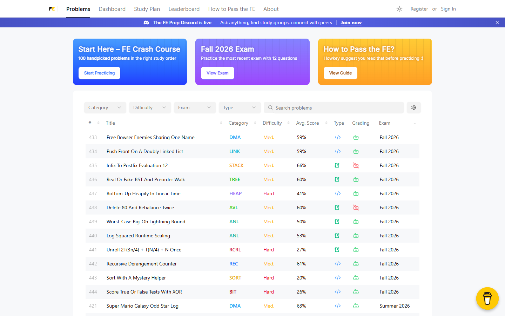
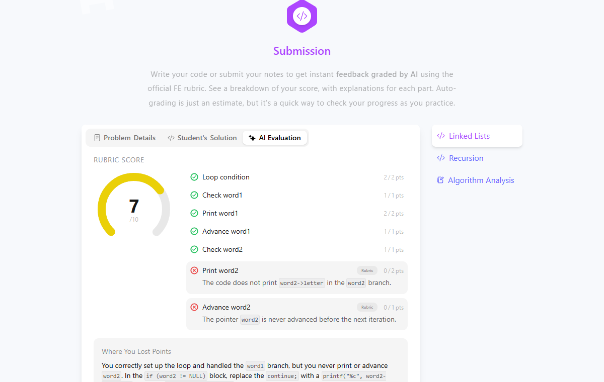

# FE Prep: AI-Graded Practice for UCF's Foundation Exam 🎓🤖

**[feprep.net](https://feprep.net)** is a full-stack study platform for the University of Central Florida's Computer Science Foundation Exam (FE), the exam every UCF CS student must pass to continue in the major. It gathers every past FE problem since 2015 in one searchable place and grades students' code and written answers instantly with AI, using the official FE rubric.

> The production source code is private. This repository showcases the project.

---

## 🌟 Highlights
- **🎓 1,500+ Students**: Used by UCF computer science students preparing for the FE.
- **📚 440+ Real Exam Problems**: Every problem from 35 past exams since 2015, with filters by topic, difficulty and exam, plus 248 video solutions.
- **🤖 Instant AI Grading**: Submit C code or written answers and get a rubric-by-rubric score with explanations in about 7 seconds.
- **🗺️ Study Plans**: The FE-100 crash course (100 handpicked problems in the right order), topic-focused plans and mock exams.
- **🏆 Progress Tracking**: Solved/attempted history and per-semester leaderboards.
- **💬 Community**: A Discord server for questions and study groups.

---

## Problem Bank

---

## 🚀 How It Works

1. **Pick a Problem**: Search the problem bank or follow a study plan.
2. **Solve It**: Write your code or answer directly in the browser.
3. **Get AI Feedback**: The autograder scores each rubric item, explains every lost point and shows what to fix.
4. **Track Progress**: Your dashboard and leaderboards update as you practice.

---

## 🛠️ Tech Stack

- **Frontend**: Next.js 15, React 19, TypeScript, React Query
- **Backend**: Next.js route handlers on Vercel serverless functions and cron jobs (44 REST API handlers)
- **Database**: PostgreSQL (Neon serverless) with Prisma ORM
- **AI**: OpenAI o4-mini with schema-validated structured outputs, plus an LLM PDF-ingestion pipeline that built the problem bank
- **Auth & Security**: NextAuth (Google and GitHub OAuth), 4-role access control enforced in edge middleware and re-checked against the database, Zod request validation, 3-tier rate limiting
- **Storage & Delivery**: AWS S3 + CloudFront
- **Analytics**: PostHog

---

## 📈 Achievements
- **1,500+ Students** registered on the platform.
- **85,000+ Answers Graded** by the AI autograder at a ~7-second median.
- **440+ Problems** covering every FE since 2015.
- **1,100+ Commits**, designed, built and operated solo.

---

## 💡 Why FE Prep?

Past FE problems were scattered across PDFs, and students had no quick way to check their answers against the rubric. FE Prep puts every problem in one place and gives instant, rubric-based feedback, so students can practice more and walk into the exam prepared. Auto-grading is an estimate, but it is a fast way to find and fix mistakes.

---
### Developed by:
Dmytro Chygarov, UCF Computer Science student. Designed, built and operated FE Prep end to end.
